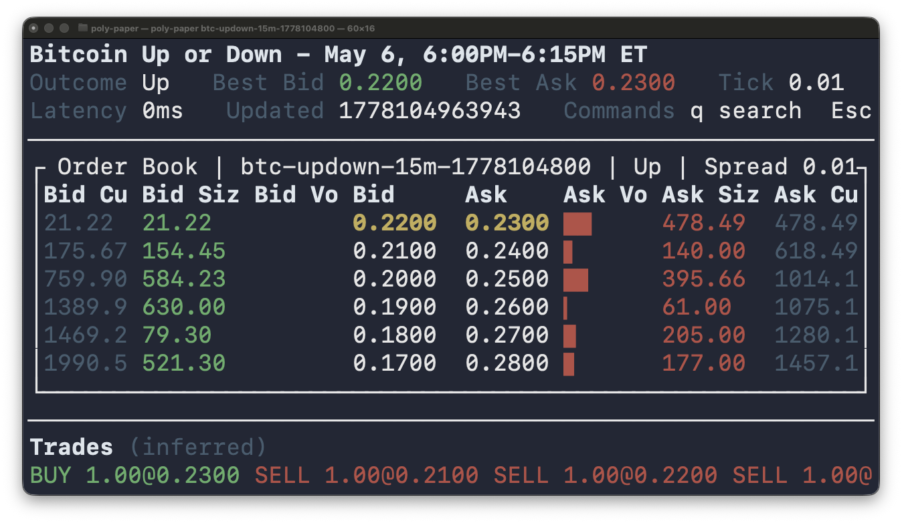

# poly-paper

[](https://github.com/rajatasusual/poly-paper/actions/workflows/ci.yml)


A terminal order book viewer and paper arbitrage runner for Polymarket markets.

`poly-paper` searches active Polymarket events, lets you pick a CLOB-backed market, and streams CLOB order books into a Ratatui interface. It shows aggregated bid/ask levels for the displayed outcome while tracking every market outcome in memory to detect complete-set arbitrage opportunities.

When an opportunity appears, the app records an in-memory paper execution. At exit or market close, it writes a JSON trade log to `logs/<market-slug>.json`.

## Screenshot



## Features

- Search active Polymarket events from the terminal
- Browse event markets with pagination
- Connect to Polymarket CLOB websocket order book updates
- View bids, asks, cumulative depth, spread, tick size, and update timestamp
- Adjust price aggregation while the book is live
- Detect complete-set arbitrage across all market outcomes
- Paper trade detected opportunities without placing real orders
- Poll Gamma for market closure and finalize paper PnL on close
- Save structured JSON logs under `logs/` using the market slug as the file name

## Architecture

For the full architecture notes, see [src/README.md](src/README.md).

| Module | Responsibility |
| --- | --- |
| [`src/main.rs`](src/main.rs) | Parses CLI arguments, resolves an optional slug, and drives the search/view loop. |
| [`src/app.rs`](src/app.rs) | Owns the live market TUI loop, terminal lifecycle, key handling, close polling, websocket task wiring, and JSON log writing. |
| [`src/gamma.rs`](src/gamma.rs) | Wraps Polymarket Gamma API calls for market lookup and active event search. |
| [`src/orderbook.rs`](src/orderbook.rs) | Applies websocket book snapshots to `AppState` and detects complete-set arbitrage opportunities. |
| [`src/picker.rs`](src/picker.rs) | Implements the interactive event and market selection prompts. |
| [`src/prompt.rs`](src/prompt.rs) | Provides the shared stdin prompt helper. |
| [`src/render.rs`](src/render.rs) | Renders the Ratatui order book, header, status lines, volume bars, and arbitrage tape. |
| [`src/session.rs`](src/session.rs) | Converts a Gamma market into the initial `MarketSession`, outcome-token mapping, order books, and paper-trade state. |
| [`src/types.rs`](src/types.rs) | Defines shared state, arbitrage opportunities, paper-trade logs, event/search structs, constants, and control-flow enums. |
| [`src/ws.rs`](src/ws.rs) | Subscribes to Polymarket CLOB websocket order book updates and forwards them over a channel. |

## Requirements

- Rust toolchain with Cargo
- Network access to Polymarket Gamma and CLOB websocket APIs

## Run

Start the app and search interactively:

```sh
cargo run
```

Open a market directly by slug:

```sh
cargo run -- <market-slug>
```

If the slug cannot be resolved, the app falls back to interactive search.

## Paper Arbitrage

The paper trader watches the best bid and ask for every outcome in the selected market.

It records a paper execution when either complete-set condition is true:

| Strategy | Condition | Interpretation |
| --- | --- | --- |
| Buy complete set | `sum(best asks) < 1` | Buy one share of every outcome for less than the guaranteed `1` payout. |
| Sell complete set | `sum(best bids) > 1` | Sell one share of every outcome for more than the guaranteed `1` payout. |

Execution size is the minimum available top-level size across all legs, capped by available paper cash. The app blocks repeat executions against the same unchanged price level.

This is paper trading only. It does not submit CLOB orders.

## Logs

When the market view exits, the app writes:

```text
logs/<market-slug>.json
```

The JSON includes market metadata, outcomes, exit reason, cash, pending settlement payout, realized/locked/total PnL, and per-leg execution details such as outcome, token ID, side, price, size, available size, and notional.

## Search Controls

When searching:

| Input | Action |
| --- | --- |
| text | Search for events, or start a new search from the event picker |
| number | Select an event or market from the current page |
| `n` | Next page |
| `p` | Previous page |
| `q` or blank input | Back to search query |
| `b` | Back from market picker to event picker |
| `x` | Quit |

## Market View Controls

| Key | Action |
| --- | --- |
| `Up` / `Down` | Scroll visible order book levels |
| `+` | Double aggregation tick size |
| `-` | Halve aggregation tick size |
| `q` | Leave the current market and search again |
| `Esc` or `Ctrl-C` | Quit |

## Development

Build the project:

```sh
cargo build
```

Check formatting:

```sh
cargo fmt --check
```

Run Clippy:

```sh
cargo clippy
```

## Notes

This is a live market-data TUI. Displayed order book data depends on Polymarket API availability and the selected market having CLOB token IDs. The arbitrage tape is based on local order book snapshots and does not account for fees, order placement latency, partial fills beyond top-of-book sizing, or failed real-world execution.
